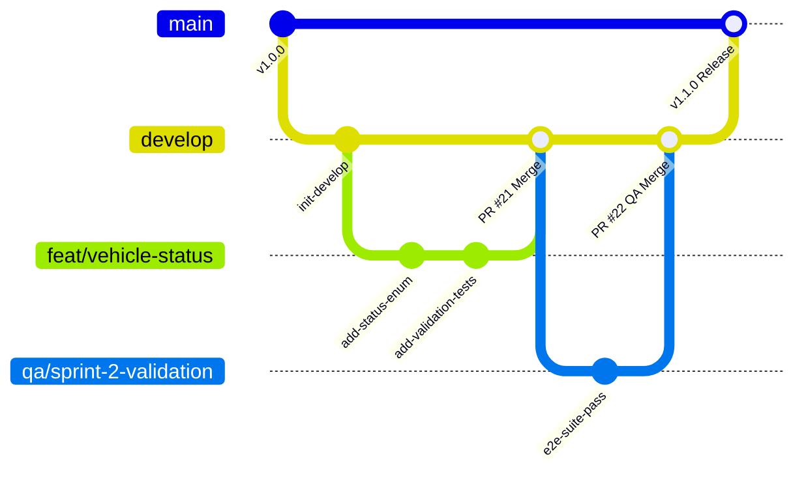

# FleetFlow Branching Strategy & Governance Guide

This document defines the official branching strategy, naming conventions, pull request lifecycle, and branch protection policies for the **FleetFlow** repository. All contributors and evaluators must follow these standards to ensure project stability and traceable releases.

---

## 1. Branching Model Overview

FleetFlow utilizes a structured **GitFlow / GitHub Flow hybrid model** tailored for microservice systems. The model separates stable production releases from ongoing sprint integration and isolated feature work.



---

## 2. Core Branch Hierarchy

| Branch | Purpose | Lifecycle | Protection Level | Target Merge From |
| :--- | :--- | :--- | :--- | :--- |
| `main` | Production-ready, deployed release state. Every commit is tested and stable. | Permanent | **High (Strictly Protected)** | `develop` or `hotfix/*` |
| `develop` | Sprint integration branch. Aggregates completed features before staging/release. | Permanent | **High (Protected)** | `feat/*`, `bugfix/*`, `qa/*` |
| `feat/*` | New user stories, services, endpoints, or UI capabilities. | Ephemeral (Deleted on merge) | Standard PR validation | Branched from `develop` |
| `bugfix/*` | Defect fixes identified in development or QA cycles. | Ephemeral (Deleted on merge) | Standard PR validation | Branched from `develop` |
| `qa/*` | Test automation suites, seed scripts, regression benchmarks. | Ephemeral (Deleted on merge) | Standard PR validation | Branched from `develop` |
| `chore/*` | Dependency updates, tooling, build scripts, documentation. | Ephemeral (Deleted on merge) | Standard PR validation | Branched from `develop` |
| `hotfix/*` | Urgent patches for critical production defects. | Ephemeral (Deleted on merge) | High PR validation | Branched from `main` |

---

## 3. Consistent Branch Naming Conventions

All branch names must be lowercase, use hyphens `-` for word separation, and follow the `<category>/<short-description>` pattern.

### Approved Formats & Examples

| Prefix | Scope | Valid Example | Invalid Example |
| :--- | :--- | :--- | :--- |
| `feat/` | New business logic, APIs, or UI components | `feat/vehicle-operational-status`<br>`feat/booking-lifecycle` | `VehicleStatus`<br>`new-feature` |
| `bugfix/` | Bug fixes for identified defects | `bugfix/jwt-expiration-mismatch`<br>`bugfix/filter-null-pointer` | `fix-bug`<br>`bug123` |
| `qa/` | Testing infrastructure & test suites | `qa/sprint-1-rbac-tests`<br>`qa/vehicle-search-coverage` | `test`<br>`qa_tests` |
| `chore/` | Build scripts, tooling, configs | `chore/unified-build-script`<br>`chore/update-docker-compose` | `update`<br>`misc` |
| `hotfix/` | Emergency production patches | `hotfix/identity-db-connection-leak` | `urgent-fix` |

---

## 4. Branch Protection Policies

To prevent accidental regressions and enforce quality gates, **`main`** and **`develop`** must have GitHub branch protection enabled.

### Enforced Rules for `main` and `develop`

1. **Require a Pull Request Before Merging**:
   - Direct commits via `git push origin main` or `git push origin develop` are strictly prohibited.
   - At least **1 peer code review approval** required.
   - Dismiss stale pull request approvals when new commits are pushed.

2. **Require Status Checks to Pass Before Merging**:
   - The merge button remains locked until all CI pipeline jobs pass:
     - `Backend : Build & Package`
     - `Backend : Automated Tests` (xUnit test suite)
     - `Frontend : Lint & Code Quality` (ESLint)
     - `Frontend : Automated Tests` (Node test runner)
     - `Frontend : Production Build` (Vite)
     - `CI : Quality Gate Validation`
   - **Require branches to be up to date before merging** (ensures testing against latest integration state).

3. **Enforce Merge Discipline**:
   - Enable **Squash and Merge** or **Rebase and Merge** to maintain a clean, linear git history.
   - Delete head branch automatically upon PR merge.

4. **Include Administrators**:
   - Ensure repository administrators and project leads cannot accidentally bypass CI checks.

### Step-by-Step GitHub Configuration

1. In the GitHub repository, navigate to **Settings** > **Branches**.
2. Click **Add branch protection rule**.
3. In **Branch name pattern**, enter `main` (and repeat for `develop`).
4. Check **Require a pull request before merging** -> Check **Require approvals** (minimum 1).
5. Check **Require status checks to pass before merging** -> Select:
   - `Backend : Build & Package`
   - `Backend : Automated Tests`
   - `Frontend : Lint & Code Quality`
   - `Frontend : Automated Tests`
   - `Frontend : Production Build`
   - `CI : Quality Gate Validation`
6. Check **Require branches to be up to date before merging**.
7. Check **Do not allow bypassing the above settings**.
8. Click **Save changes**.

---

## 5. End-to-End Developer Workflow

### Step 1: Sync and Branch
```bash
git checkout develop
git pull origin develop
git checkout -b feat/vehicle-telemetry-feed
```

### Step 2: Local Development & Pre-Commit Verification
Run the unified build and test script locally before opening a pull request:
```powershell
# Windows
.\build.ps1

# Linux / macOS
./build.sh
```

### Step 3: Commit and Push
```bash
git add .
git commit -m "feat(fleet): implement vehicle telemetry polling endpoint and tests"
git push -u origin feat/vehicle-telemetry-feed
```

### Step 4: Open Pull Request
- Target branch: `develop`
- Fill in the PR description template detailing changes, test results, and relevant issues.
- Confirm all CI/CD pipeline checks pass.
- Request review from a teammate or lead.

### Step 5: Merge & Clean Up
Once approved and CI checks are green, select **Squash and Merge**. Delete the remote and local feature branch.
