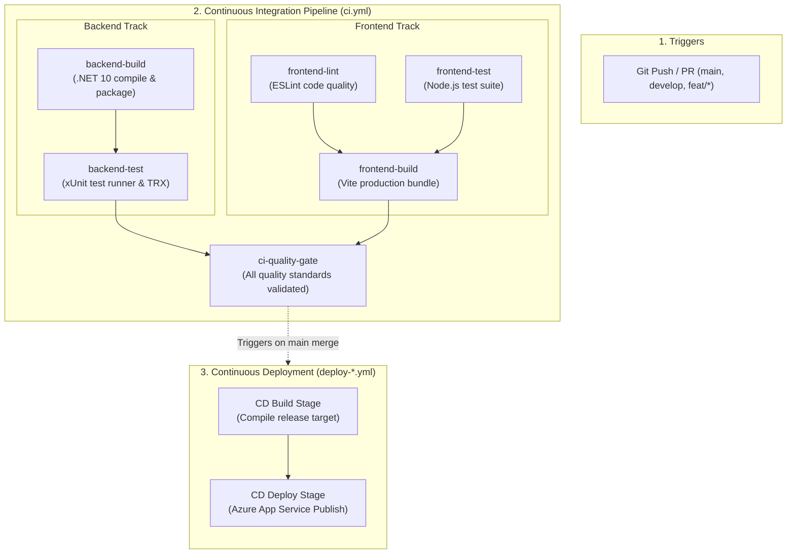

# FleetFlow CI/CD Pipeline Architecture & Operations Guide

This guide documents the Continuous Integration and Continuous Deployment (CI/CD) pipelines in FleetFlow, detailing stage separation, artifact flow, pipeline monitoring, and troubleshooting runbooks.

---

## 1. Pipeline Architecture & Job Separation

The FleetFlow CI/CD pipeline is designed with **strict job isolation**. Every distinct phase of the verification lifecycle executes in a separate job. This ensures that failures are immediately traceable to a specific stage (compilation, automated testing, static analysis, or cloud deployment) without digging through monolithic job logs.



---

## 2. CI/CD Stage Breakdown & Failure Attribution

| Job / Stage | Scope & Tools | Outputs / Artifacts | How Failure is Attributed |
| :--- | :--- | :--- | :--- |
| **`backend-build`** | `dotnet restore`<br>`dotnet build --configuration Release`<br>`dotnet publish` | `backend-binaries`<br>(IdentityService & FleetService) | **Compilation / Syntax / Missing NuGet Package**.<br>If this fails, no backend tests run. |
| **`backend-test`** | `dotnet test --no-build`<br>Runs 170+ xUnit tests | `backend-test-results`<br>(TRX logs) | **Backend Logic Regression / Assertion Failure**.<br>TRX artifact contains exact failing test case and stack trace. |
| **`frontend-lint`** | `npm run lint`<br>ESLint 9.x | Console report | **Frontend Formatting / Code Style / Linter Error**.<br>Flags unused variables, invalid hooks, or syntax issues. |
| **`frontend-test`** | `npm test -- --run`<br>102+ client unit tests | Console report / TAP | **Client-side State / Logic / Validation Error**.<br>Flags client regression without waiting for bundle compilation. |
| **`frontend-build`** | `npm run build`<br>Vite production bundler | `frontend-dist`<br>(Production static bundle) | **Vite Bundle Error / Asset Resolution Failure**.<br>Only runs after linting and tests pass. |
| **`ci-quality-gate`** | Aggregation barrier | Pipeline badge green status | **Overall Quality Assurance Gate**.<br>Guarantees all sub-systems are verified before deployment. |
| **`deploy-*`** | Isolated `build` and `deploy` jobs | Azure App Service deployment | **Environment / Credential / Cloud Configuration Failure**.<br>Isolated from code logic issues. |

---

## 3. Best Practices & Pipeline Health Governance

### 1. Test Locally Before Presentation and Merge
Never rely solely on remote CI to catch errors on presentation day.
- Run `.\build.ps1` (Windows) or `./build.sh` (Linux/macOS) prior to pushing.
- Both scripts execute the exact sequence run by the GitHub Actions runners.

### 2. Prompt Triage: Fix Broken Builds Immediately
Broken builds must not be left unaddressed:
1. **Identify the Failing Stage**: Look at the GitHub Actions workflow summary matrix. The red icon immediately identifies whether it is `backend-build`, `backend-test`, `frontend-lint`, `frontend-test`, or `frontend-build`.
2. **Examine the Artifacts / Logs**:
   - For `backend-test` failures, download the `backend-test-results` artifact to inspect the `.trx` file.
   - For frontend errors, check the step console output.
3. **Reproduce Locally**:
   ```powershell
   # Run only backend tests
   dotnet test FleetFlow.sln

   # Run only frontend tests
   cd src/frontend ; npm test -- --run
   ```
4. **Deploy Immediate Fix**: Branch from `develop` using `bugfix/<issue-name>`, apply the fix, verify locally, and submit a PR.

### 3. Pipeline Monitoring
- **Workflow Badges**: Embedded in `README.md` to display real-time build status.
- **GitHub Notifications**: Developers receive email and browser notifications for any failed run on their branches.
- **Action Run History**: Accessible via `https://github.com/IT24103433/Fleet_Flow/actions`.
